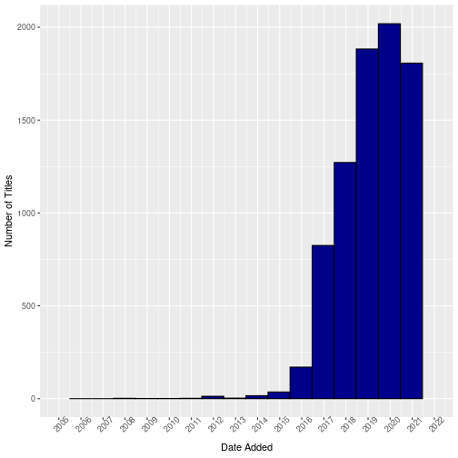

# Movie Recommendation System

This idea comes from the Kaggle dataset:
https://www.kaggle.com/shivamb/netflix-shows

We aim to perform EDA on the dataset of Netflix Shows and Movies, with the end-goal of creating a machine learning based recommendation system (returning 10 related movies or shows based on a user selection from the dataset).

## EDA

### Set Preliminaries


```r
library(ggplot2)
data_loc <- "~/Projects/Movie-Suggestion-System/data"
```
### Load-in data, initial summaries and error correction


```r
netflix_data <- read.csv(paste(data_loc, "/netflix_titles.csv", sep = ""), stringsAsFactors=FALSE)
dim(netflix_data)
```

```
## [1] 8807   12
```

```r
netflix_data[1,]
```

```
##   show_id  type                title        director cast       country
## 1      s1 Movie Dick Johnson Is Dead Kirsten Johnson      United States
##           date_added release_year rating duration     listed_in
## 1 September 25, 2021         2020  PG-13   90 min Documentaries
##                                                                                                                                                description
## 1 As her father nears the end of his life, filmmaker Kirsten Johnson stages his death in inventive and comical ways to help them both face the inevitable.
```
Our dataset contains 8807 entries with 12 features. Most of these are discrete-factor features, such as Type (only "Movie" or "TV Show"), Country, Rating, or Release Year. There are more free-text features also, such as Title and Description, and to a lesser extent Cast (which contains comma separated lists of cast members). I've decided not to interpret all string features as factors, but rather convert the necessary columns to factors as and when I need.

The following are some summaries for the more discrete features of the data:


```
## [1] "Type"
```

```
## 
##   Movie TV Show 
##    6131    2676
```

```
## [1] "Country"
```

```
## 
##  United States          India                United Kingdom          Japan 
##           2818            972            831            419            245 
##    South Korea 
##            199
```

```
## [1] "Age Rating"
```

```
## 
##    TV-MA    TV-14    TV-PG        R    PG-13    TV-Y7     TV-Y       PG 
##     3207     2160      863      799      490      334      307      287 
##     TV-G       NR        G TV-Y7-FV             NC-17       UR   66 min 
##      220       80       41        6        4        3        3        1 
##   74 min   84 min 
##        1        1
```

Before we begin, however, the Age Rating feature clearly has erroneous entries, as time-values like "84 min", "74 min", etc almost definitely belong in the Duration column. It's simple to find these and correct them, and this also serves as a reminder that we should naturally keep an eye out for any other mistakes in the dataset:


```r
error_indices = which(netflix_data$rating == "84 min" | netflix_data$rating == "74 min" | netflix_data$rating == "66 min")
netflix_data[error_indices, c("duration", "rating")] = netflix_data[error_indices, c("rating", "duration")]
netflix_data[error_indices,]
```

```
##      show_id  type                                title   director       cast
## 5542   s5542 Movie                      Louis C.K. 2017 Louis C.K. Louis C.K.
## 5795   s5795 Movie                Louis C.K.: Hilarious Louis C.K. Louis C.K.
## 5814   s5814 Movie Louis C.K.: Live at the Comedy Store Louis C.K. Louis C.K.
##            country         date_added release_year rating duration listed_in
## 5542 United States      April 4, 2017         2017          74 min    Movies
## 5795 United States September 16, 2016         2010          84 min    Movies
## 5814 United States    August 15, 2016         2015          66 min    Movies
##                                                                                                                                               description
## 5542           Louis C.K. muses on religion, eternal love, giving dogs drugs, email fights, teachers and more in a live performance from Washington, D.C.
## 5795    Emmy-winning comedy writer Louis C.K. brings his caustic wit to Milwaukee, offering up his unique and uncensored take on sex, parenting and more.
## 5814 The comic puts his trademark hilarious/thought-provoking spin on finding a bat in his kitchen, seeing rats having sex, Boston accents and dead pets.
```

We can also generate some plots to visualise the spread of releases over time, by either Date Added or Release Year:


```r
netflix_data$date_added <- as.Date(netflix_data$date_added, format = "%B %d, %Y")
ggplot(netflix_data, aes(x = date_added)) + geom_histogram(binwidth=365, fill="darkblue",color="black") + labs(x="Date Added", y="Number of Titles") + scale_x_date(date_breaks = "years", date_labels = "%Y", limits=c(dmy("1-1-05"), dmy("31-12-21"))) + theme(axis.text.x = element_text(angle = 45))
```

```
## Warning: Removed 98 rows containing non-finite values (stat_bin).
```

```
## Warning: Removed 2 rows containing missing values (geom_bar).
```


